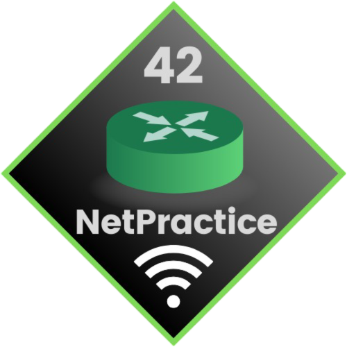
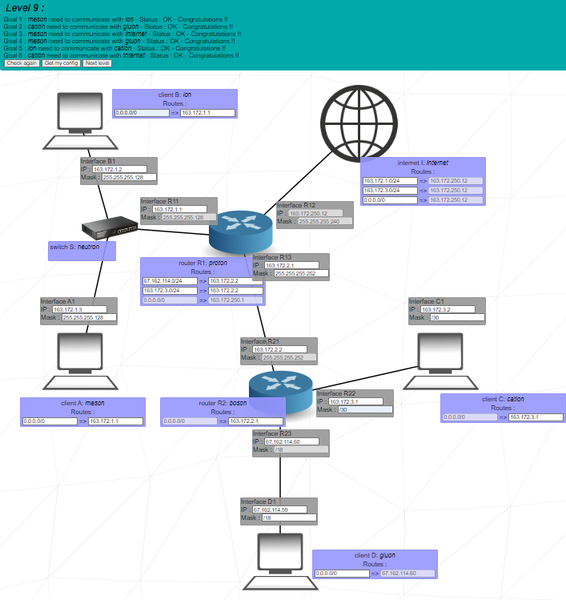
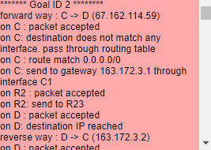

  
  <h2>42 NETPRACTICE PROJECT</h2>
    
    
    
    
    
   
<h4>
    <a href="https://github.com/emre-mr246/42_ring4_netpractice/issues">❔ Ask a Question</a>
   · 
    <a href="https://github.com/emre-mr246/42_ring4_netpractice/issues">🪲 Report Bug</a>
   · 
    <a href="https://github.com/emre-mr246/42_ring4_netpractice/issues">💬 Request Feature</a>
</h4>

## Introduction 🚀

42 Net Practice is a project designed to enhance skills in network management through practical exercises in a simulated environment, similar to Cisco Packet Tracer. Participants engage in real-world scenarios to build their networking, troubleshooting, and management skills.

10 Distinct Exercises: The project includes 10 exercises, each representing a unique networking concept or challenge, allowing participants to gain a comprehensive understanding of various topics.

## Image 📸

## Log Image 📸

